## Q.1 You need to create a calculated column to display the month based on the reporting requirements. Which DAX expression should you use?
* A. FORMAT('Date'[date], "MMM YYYY")
* B. FORMAT('Date' [date], "M YY")
* C. FORMAT('Date'[date_id], "MMM") & "" & FORMAT('Date'[year], "#")
* D. FORMAT('Date' [date_id], "MMM YYYY")
## Answer: A


## Q.2 You need to create the required relationship for the executive's visual. What should you do before you can create the relationship?
* A. Change the data type of Sales[region_id] to Whole Number.
* B. In the Sales table, add a measure for sum(sales_amount).
* C. Change the data type of sales[sales_id] to Text.
* D. Change the data type of sales [region_id] to Decimal Number.

## Answer: A

## Q.3 What should you create to meet the reporting requirements of the sales department?
* A. a measure that uses a formula of SUM (Sales [sales_id])
* B. a calculated column that use a formula of COUNTA(sales [sales_id])
* C. a measure that uses a formula of COUNTROWS (Sales)
* D. a calculated column that uses a formula of SUM (Sales [sales_id])

## Answer: C

## Q.4 You need to recommend a strategy to consistently define the business unit, department, and product category data and make the data usable across reports.
What should you recommend?
* A. Create a shared dataset for each standardized entity.
* B. Create dataflows for the standardized data and make the dataflows available for use in all imported datasets.
* C. For every report, create and use a single shared dataset that contains the standardized data.
* D. For the three entities, create exports of the data from the Power Bl model to Excel and store the data in Microsoft OneDrive for others to use as a source.

## Answer: B

## Q.5 You need to create the On-Time Shipping report. The report must include a visualization that shows the percentage of late orders.
Which type of visualization should you create?
* A. bar chart
* B. scatterplot
* C. pie chart

## Answer: A

## Q.6 You need to design the data model and the relationships for the Customer Details worksheet and the Orders table by using Power BI. The solution must meet the report requirements. For each of the following statement, select Yes if the statement is true, Otherwise, select No. NOTE: Each correct selection is worth one point
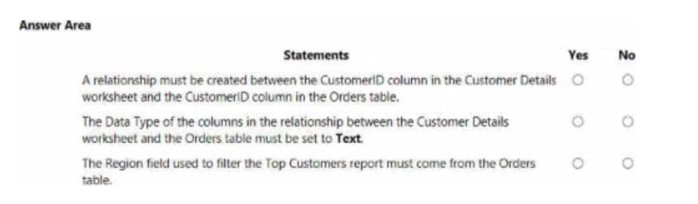

## Answer:
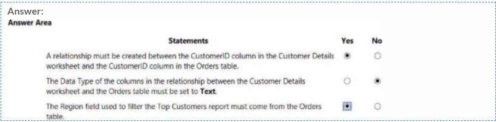

## Q.7  You have a Microsoft Power Bl dashboard. The report used to create the dashboard uses an imported dataset from a Microsoft SQL Server data source. The dashboard is shown in the exhibit. (Click the Exhibit tab.) What occurred at 12:03:06 PM?

* A. A user pressed F5
* B. A new transaction was added to the data source.
* C. A user added a comment to a tile.
* D. The dashboard tile cache refreshed.

## Answer D

## Q.8 You have a table that contains sales data and approximately 1,000 rows. You need to identify outliers in the table. Which type of visualization should you use?
* A. area chart
* B. donut chart
* C. scatter plot
* D. pie chart

## Answer: C

## Q.9 You have a dataset named Pens that contains the following columns: Unit Price Quantity Ordered You need to create a visualization that shows the relationship between Unit Price and Quantity Ordered. The solution must highlight orders that have a similar unit price and ordered quantity.

Which type of visualization and which feature should you use? To answer, select the appropriate options in the answer area.
NOTE: Each correct selection is worth one point.

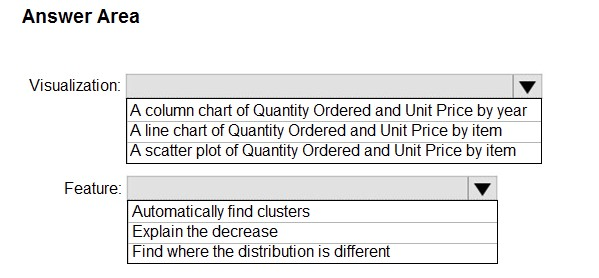

## Answer:
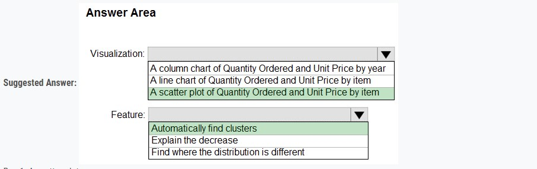


### Q.10 You need to create the Top Customers report. Which type of filter should you use, and at which level should you apply the filter? To answer, select the appropriate options in the answer area. 

### NOTE: Each correct selection is worth one point


### Q11. You need to create a relationship between the Weekly_Returns table and the Date table to meet the reporting requirements of the regional managers. What should you do?

* A. In the Weekly.Returns table, create a new calculated column named date-id in a format of yyyymmdd and use the calculated column to create a relationship to
the Date table.
* B. Add the Weekly_Returns data to the Sales table by using related DAX functions.
* C. Create a new table based on the Date table where date-id is unique, and then create a many-to-many relationship to Weekly_Return.

### Answer: A

### Q12. You need to address the data concerns before creating the data model. What should you do in Power Query Editor?

* A. Select Column distribution.
* B. Select the sales_amount column and apply a number filter.
* C. Select Column profile, and then select the sales_amount column.
* D. Transform the sales_amount column to replace negative values with 0.

### Answer: C


### Q13  You need to create the Top Customers report. Which type of filter should you use, and at which level should you apply the filter? To answer, select the appropriate options in the answer area. NOTE: Each correct selection is worth one point.

### Hot Area

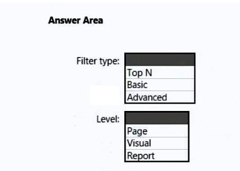

## Answer:
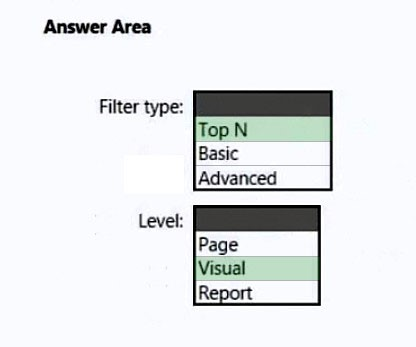


### Q14 You have a Microsoft SQL Server database that has the tables shown in the Database Diagram exhibit. (Click the Exhibit.) 


### You plan to develop a Power BI model as shown in the Power BI Model exhibit. (Click the Exhibit). You plan to use Power BI to import data from 2013 to 2015. Product Subcategory [Subcategory] contains NULL values. End of repeated scenario. You implement the Power BI model. You need to add a measure to rank total sales by product. The results must appear as shown in the following table. 

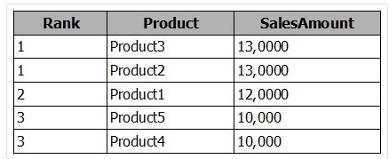


### Which DAX formula should you use

* A. Product Ranking= RANKX (Product, [SalesAmount], , DESC, Skip)
* B. Product Ranking= RANKX (ALL, (‘Product’), [SalesAmount], , DESC, Dense)
* C. Product Ranking= RANKX (ALL, (‘Product’), [SalesAmount], , DESC, Skip)
* D. Product Ranking= RANKX (ALL (‘Product’), [SalesAmount], , Asc, Dense

### Answer B


### Q15  You have a Microsoft SQL Server database that has the tables shown in the Database Diagram exhibit. (Click the Exhibit.)


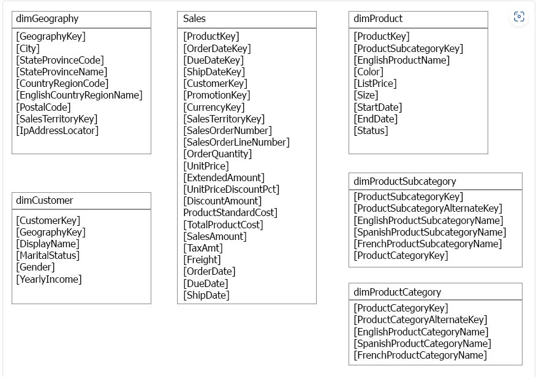

You plan to develop a Power BI model as shown in the Power BI Model exhibit. (Click the Exhibit).
You plan to use Power BI to import data from 2013 to 2015. Product Subcategory [Subcategory] contains NULL values. End of repeated scenario.

You implement the Power BI model.

You add another table named Territory to the model. A sample of the data is shown in the following table.

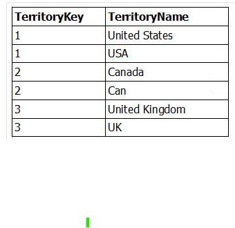

You need to create a relationship between the Territory table and the Sales table.
Which function should you use in the query for Territory before you create the relationship?

* A. Table.RemoveMatchingRows
* B. Table.Distinct
* C. Table.InDistinct
* D. Table.ReplaceMatchingRows

###  B


### Q16 You are building a financial report by using Power BI. You have a table named financials that contains a column named Date and a column named Sales. You need to create a measure that calculates the relative change in sales as compared to the previous quarter. How should you complete the measure? 
### To answer, select the appropriate options in the answer area. NOTE: Each correct selection is worth one point.
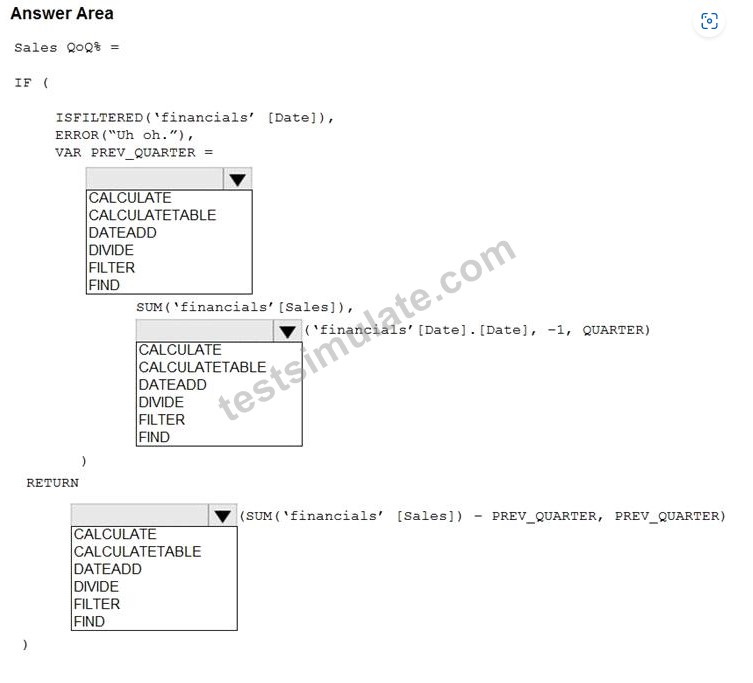

### Answer
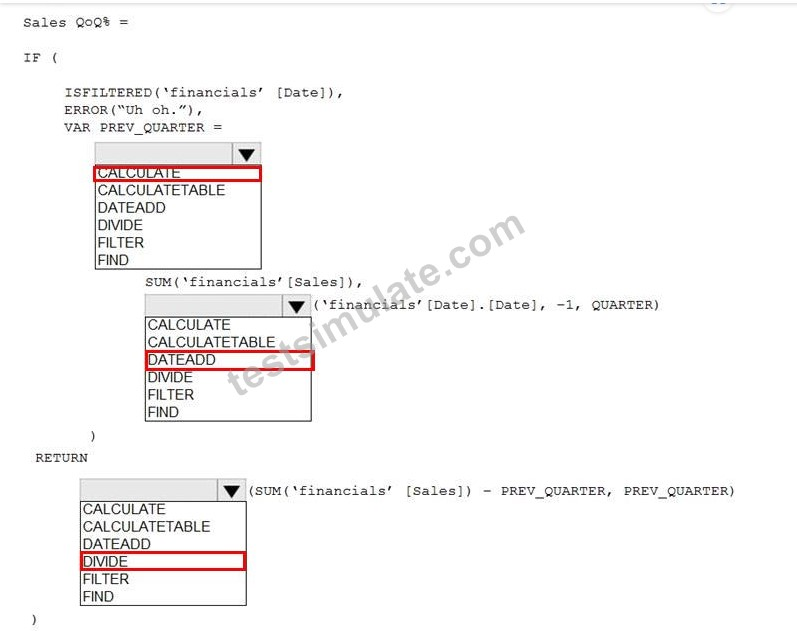


### Q17 You create the following step by using Power Query Editor. - Table.ReplaceValue(SalesLT_Address,"1318","1319",Replacer.ReplaceText,{"AddressLine1"}) A row has a value of 21318 Lasalle Street in the AddressLine1 column.

### What will the value be when the step is applied
* A. 1318
* B. 1319
* C. 21318 Lasalle Street
* D. 21319 Lasalle Street

### Answer D

### Q18  You have a Microsoft Power Bl dashboard. The report used to create the dashboard uses an imported dataset from a Microsoft SQL Server data source. The dashboard is shown in the exhibit. (Click the Exhibit tab.)  What occurred at 12:03:06 PM?
* A. A user pressed F5
* B. A new transaction was added to the data source.
* C. A user added a comment to a tile.
* D. The dashboard tile cache refreshed.

### Answer: D


### Q19 You create a parameter named DataSourceExcel that holds the file name and location of a Microsoft Excel data source. You need to update the query to reference the parameter instead of multiple hard-coded copies of the location within each query definition.

### Solution: You add a Power Apps custom visual to the report. Does this meet the goal?
* A. Yes
* B. No

### Answer: B

### Solution: In the Power Query M code, you replace references to the Excel file with DataSourceExcel. Does this meet the goal?
* A. Yes
* B. No

### Answer: A

### Q20 You have a Power BI report that uses a dataset based on an Azure Analysis Services live connection. You need to ensure that users can use Q&A from the Power BI service for the dataset.
### What should you do?
* A. From the Power BI service, add an enterprise gateway to the dataset.
* B. From Power BI Desktop, add synonyms and suggested questions.
* C. From Power BI Desktop, add a Q&A visual to the report.
* D. From the Power Bi service, select Turn on Q& A for this dataset.

### Answer: D


### Q21 You import two Microsoft Excel tables named Customer and Address into Power Query. 

### Customer contains the following columns:
```
 Customer ID
 Customer Name
 Phone
 Email Address
 Address ID
```

Address contains the following columns:

```
 Address ID
 Address Line 1
 Address Line 2
 City
 State/Region
 Country
 Postal Code
```


### The Customer ID and Address ID columns represent unique rows. You need to create a query that has one row per customer. Each row must contain City, State/Region, and Country for each customer.

### What should you do?
* A. Merge the Customer and Address tables.
* B. Transpose the Customer and Address tables.
* C. Group the Customer and Address tables by the Address ID column.
* D. Append the Customer and Address tables.

### Answer: A

### Q22 You import a large dataset to Power Query Editor.You need to identify whether a column contains only unique values.
### Which two Data Preview options can you use? Each correct answer presents a complete solution. NOTE: Each correct selection is worth one point

* A. Show whitespace
* B. Column distribution
* C. Column profile
* D. Column quality
* E. Monospaced

### Answer: BC

### Q23 You have a Power BI model that contains two tables named Sales and Date. Sales contains four columns named TotalCost, DueDate, ShipDate, and OrderDate. Date contains one column named Date. The tables have the following relationships:
```
 Sales[DueDate] and Date[Date]
 Sales[ShipDate] and Date[Date]
 Sales[OrderDate] and Date[Date]

```
### The active relationship is on Sales[DueDate]. You need to create measures to count the number of orders by [ShipDate] and the orders by [OrderDate]. You must meet the goal without duplicating data or loading additional data.

### Solution: You create measures that use the CALCULATE, COUNT, and USERELATIONSHIP DAX functions.

### Does this meet the goal?
* A. Yes
* B. No

### Answer: A


### Q24 You are creating a Microsoft Power BI data model that has the tables shown in the following table.
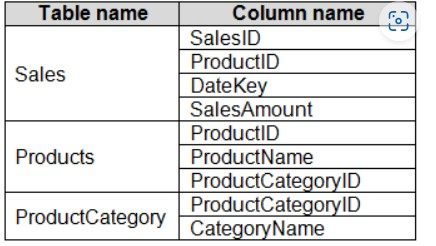
### The Products table is related to the ProductCategory table through the ProductCategoryID column. You need to ensure that you can analyze sales by product category. How should you configure the relationships from Products to ProductCategory? To answer, select the appropriate options in the answer area.

### NOTE: Each correct selection is worth one point.

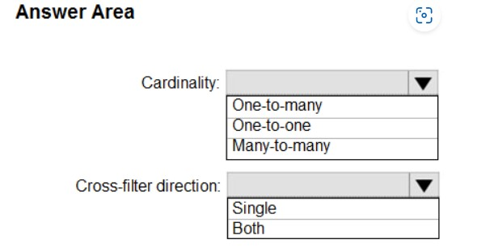

### Answer
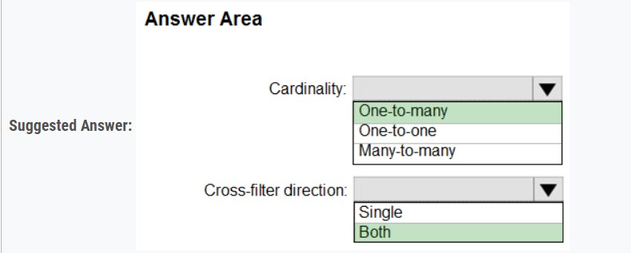


### Q25 You have the dataset shown in the following exhibit.

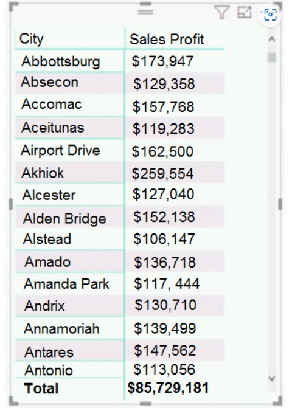

### You need to ensure that the visual shows only the 10 cities that have the highest sales profit. What should you do?

* A. Add a Top N filter to the visual.
* B. Configure the Sales Profit measure to use the RANKX function.
* C. Add a calculated column to the table that uses the TOPN functio
* D. In the visual, replace Sales Profit with the calculated column.
* E. Add a calculated column to the table that returns the city name if the city is in the top 10, otherwise the calculated column will return "Not in Top 10". In the
visual, replace Sales Profit with the calculatedcolumn.D18912E1457D5D1DDCBD40AB3BF70D5D

### Answer: A


### Q26 You need to create a visualization that compares revenue and cost over time. Which type of visualization should you use?
* A. stacked area chart
* B. donut chart
* C. line chart
* D. waterfall chart

### Answer: C


### Q27 You view a query named Transactions as shown in the following exhibit.


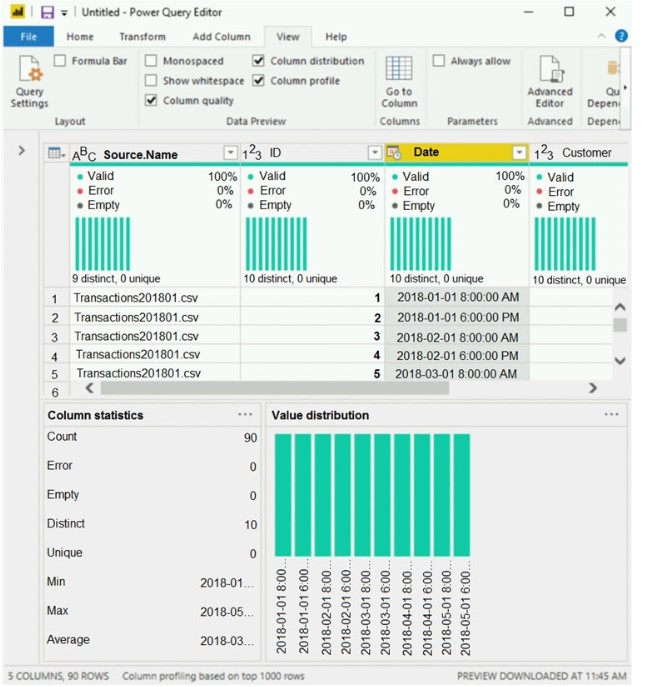

### The query gets CSV files from a folder. Use the drop-down menus to select the answer choice that completes each statement based on the information presented in the graphic.

### NOTE: Each correct selection is worth one point.

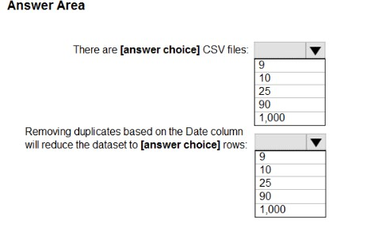
### Answer

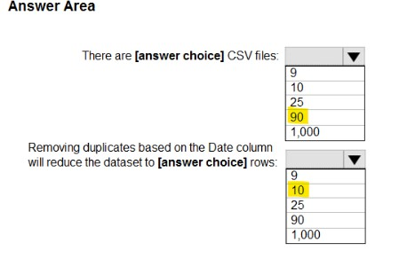


### Q28 You have sales data in a star schema that contains four tables named Sales, Customer, Date, and Product. The Sales table contains purchase and ship dates. Most often, you will use the purchase date to analyze the data, but you will analyze the data by both dates independently and together. You need to design an imported dataset to support the analysis. The solution must minimize the model size and the number of queries against the data source.

### Which data modeling design should you use?

* A. Use the Auto Date/Time functionality in Microsoft Power BI and do NOT import the Date table.
* B. Duplicate the Date query in Power Query and use active relationships between both Date tables.
* C. On the Date table, use a reference query in Power Query and create active relationships between Sales and both Date tables in the modeling view.
* D. Create an active relationship between Sales and Date for the purchase date and an inactive relationship for the ship date.

### Answer: D


### Q29 You use an R visual to produce a map of 500,000 customers. You include the values of CustomerID, Latitude, and Longitude in the fields sent to the visual. Each customer ID is unique. In powerbi.com, when users load the visual, they only see some of the customers. What is the cause of the issue?
* A. The visual was built by using a different version of R.
* B. The data comes from a Microsoft SQL Server source.
* C. The data is deduplicated.
* D. Too many records were sent to the visual.

### Answer: D


### Answer


### Q13 


### Answer


### Q13 


### Answer


### Q13 


### Answer


### Q13 


### Answer


### Q13 


### Answer


### Q13 


### Answer


### Q13 


### Answer


### Q13 


### Answer


### Q13 


### Answer


### Q13 


### Answer


### Q13 


### Answer


### Q13 


### Answer


### Q13 


### Answer


### Q13 


### Answer


### Q13 


### Answer


### Q13 


### Answer


### Q13 


### Answer


### Q13 


### Answer

